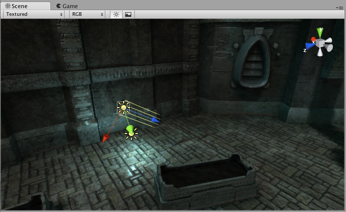

 
# Rigidbody overview 
 A **Rigidbody** 
  is the main component that enables physical behaviour for a **GameObject** 
 . With a Rigidbody attached, the object will immediately respond to gravity. If one or more **Collider** 
  components are also added, the **GameObject** is moved by incoming **collisions** 
 . 
  
 
 
 Since a Rigidbody component takes over the movement of the GameObject it is attached to, you shouldn’t try to move it from a script by changing the [Transform](https://docs.unity3d.com/Manual/class-Transform.html) properties such as position and rotation. Instead, you should apply **forces** to push the GameObject and let the **physics engine** 
  calculate the results. 
 
 [5c3c392b810f282808e52ca9](Examples/DateTimezone_5c3c392b810f282808e52ca9.cs) 
 
 There are some cases where you might want a GameObject to have a Rigidbody without having its motion controlled by the physics engine. For example, you may want to control your character directly from script code but still allow it to be detected by triggers (see *Triggers* under the [Colliders](https://docs.unity3d.com/Manual/CollidersOverview.html) topic). 
 
 
 [InstallingUnity.md](InstallingUnity.md) 
 
 
 See the [Rigidbody](https://docs.unity3d.com/Manual/class-Rigidbody.html) and [Rigidbody 2D](https://docs.unity3d.com/Manual/class-Rigidbody2D.html) reference pages for further details about the settings and scripting options for these components. 
